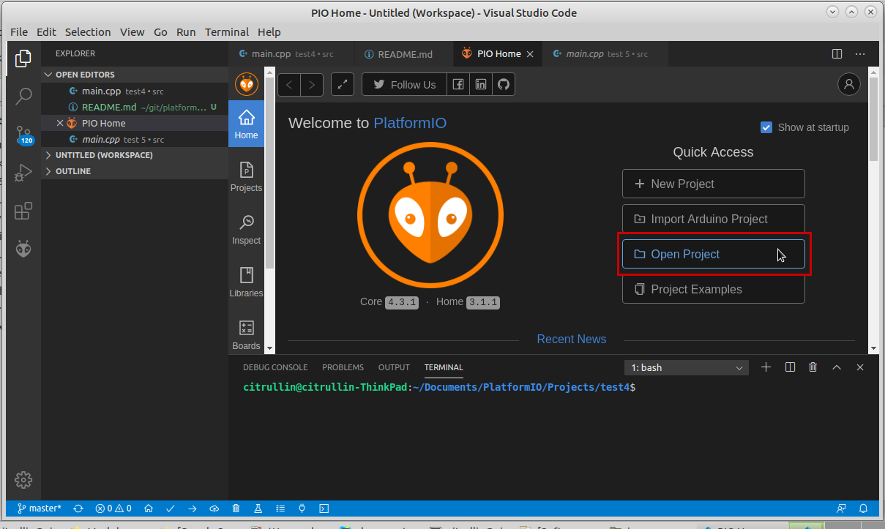
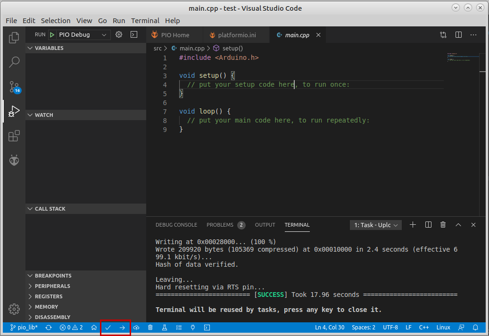
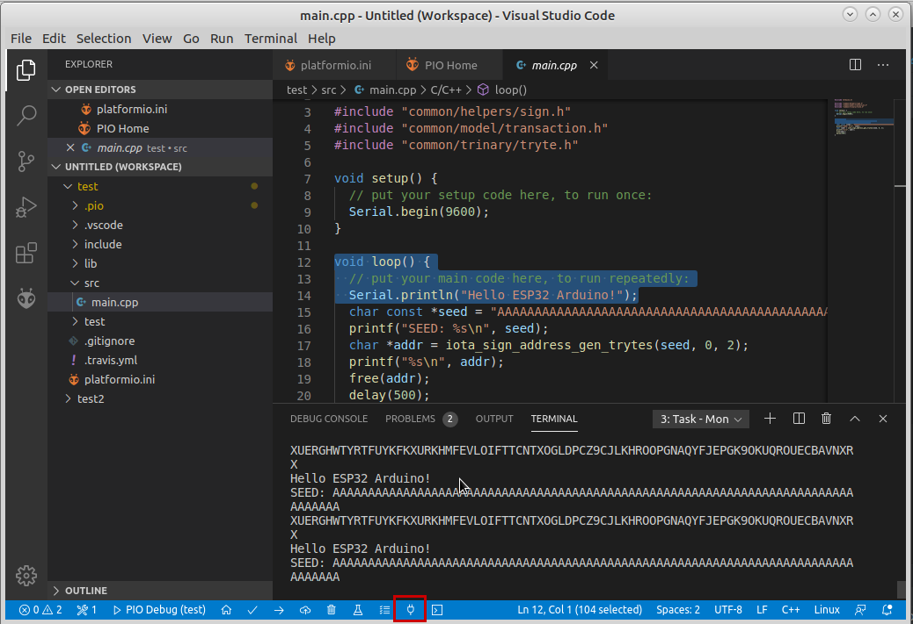

# IOTA workshop

Simple examples to interact with IOTA on PlatformIO.
[Read our documentation](https://docs.iota.org/docs/iot/0.1/platformio/introduction/get-started), before you use this workshop.

## Getting started

**1. Clone the repo**

```
git clone https://github.com/iota-community/platformio-arduino-iota-workshop.git
```

**2. Open the example**

Open the example folder for your board with the PlatformIO plugin for your IDE.
It is also possible to use the [platformIO command line interface](https://docs.platformio.org/en/latest/core/userguide/project/cmd_init.html).

The directory structure: [BOARD_NAME]/[EXAMPLE_NAME]



or

```
cd nrf52_dk/e01_generate_address
pio project init --ide vsc
```

**3. Build & upload the code**

Use the PlatformIO plugin to build and upload the code.
Or alternatively, you can use the [command line interace](https://docs.platformio.org/en/latest/core/userguide/cmd_run.html).



or

```
pio run -t upload
```

**4. Monitor the serial of your device**

Use the PlatformIO plugin to monitor the serial of your device.
You can also use the the command line interface for this.



or

```
pio run -t monitor
```

## Examples included

**nrf52_dk (nRF52832)**
- [e01_generate_address](nrf52_dk/e01_generate_address)

**bluepill_f103c6 (STM32F103C6)**
- [e01_generate_address](bluepill_f103c6/e01_generate_address)

**esp32dev (ESP32)**
- [e01_generate_address](esp32dev/e01_generate_address)
- [e02_create_singnature](esp32dev/e02_create_singnature)

**sipeed-maix-bit (Kendryte K210)**
- [e01_generate_address](sipeed-maix-bit/e01_generate_address)
- [e02_create_singnature](sipeed-maix-bit/e02_create_singnature)